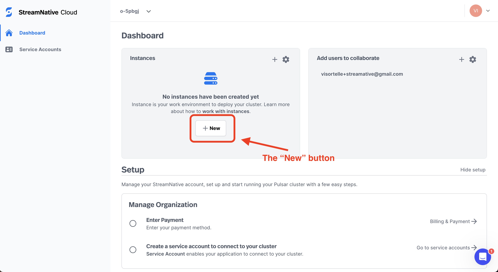

# Connect to StreamNative Cloud

[StreamNative](https://streamnative.io) is a company founded by the original Apache Pulsar authors and provides managed Pulsar instances as a service.

It is the easy and affordable way to start use Apache Pulsar.

In this tutorial we'll:

- Create a new StreamNative Cloud account
  - Create a managed Apache Pulsar instance
- Install **Dekaf Desktop** and connect it to the created Pulsar instance.

:::warning

At the time of the latest article update, the minimal StreamNative Cloud managed Apache Pulsar instance monthly cost is about **$100**.

It means that if you'll finish this tutorial in 1 hour, you'll spend less than **$1** for StreamNative Cloud.

**In order to avoid unexpected spendings** don't forget to delete the created managed Apache Pulsar instance after finishing this tutorial.

Keep in mind that the network traffic and storage goes with additional price. It isn't relevant for this tutorial, but we think it's better to warn.

**We are not responsible for further StreamNative Cloud pricing changes.**

Refer [StreamNative Cloud billing docs](https://docs.streamnative.io/docs/billing-overview) page to get an actual information.

:::

## Install Dekaf Desktop Free

## Create a Pulsar Instance

### Create StreamNative Account

- Open [StreamNative site](https://streamnative.io/) in browser and click the "Log in" link.

  

- Create your StreamNative account by clicking the "Sign up" link.

  

- Follow the "Sign up" process instructions and verify your email.

- Click the "Back to cloud console to login" button.

  

- Complete the user profile wizard.

  

### Create Pulsar Instance

- After finishing the account creating process you'll see the similar screen. Press the "New" button to create your first Pulsar instance.

  

- CLick the "Deploy Hosted" button.

  

- Fill the "Instance name" input field and click the "Cluster location" button.

  

- Fill the "Cluster name" input field and click the "Cluster Size" button.

  

- Ensure that the "Monthly base cost" value is not too high. It should be around $100.

  

- Enter you card details, click the "Create Payment Method" button, then click the "Finish" button.

  

