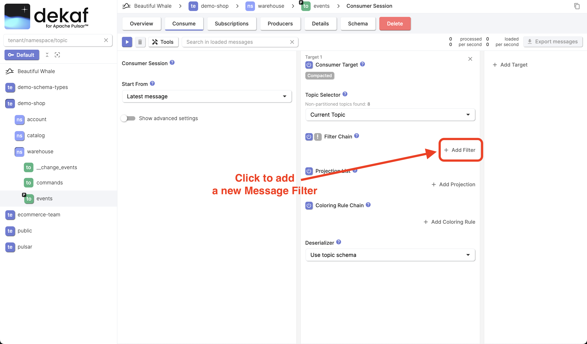
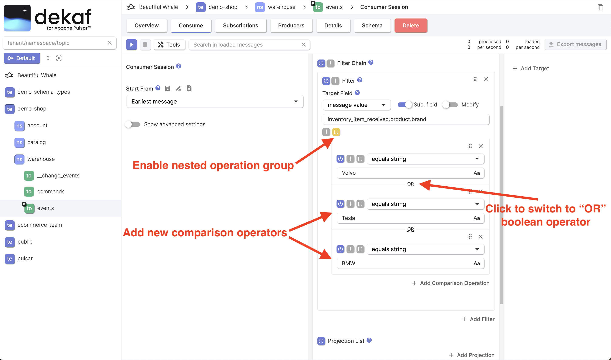
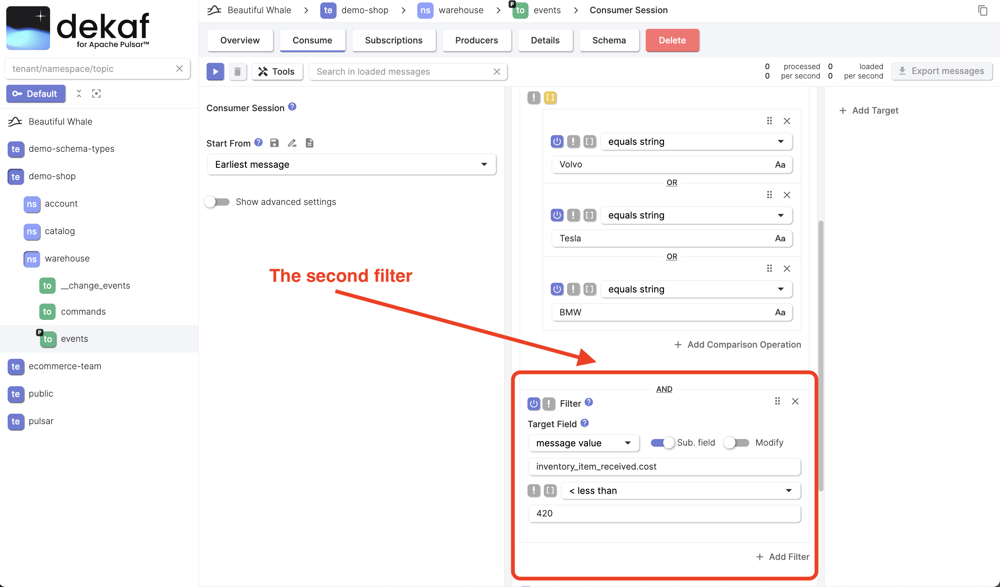

# Consumer Session Tutorial

**Consumer Session** is an object that describes how to consume Pulsar messages.

## Start Consumer Session

- Navigate to a Pulsar topic you're interested in
- Click the **Consume** button
- By default, **Consumer Session** starts from the **Latest Message** in the topic. If no producers produce new messages in realtime to the selected topic, switch the **Start From** field to **Earliest Message**
- Click the **▶** button to start the consumer session.


## Pause Consumer Session

- After starting the **Consumer Session**, you'll see the following screen
- Click the **⏸︎** button to pause the consumer session


## Inspect Specific Message

- Select an arbitrary message and click the cell under the **#** column. You can click on the space between any two columns.

- Use the keyboard arrow keys <kbd>↑</kbd> <kbd>↓</kbd> to quickly navigate over messages.


- Click the **Metadata** tab to view the message metadata.


## Search in Loaded Messages

You can quickly search for an arbitrary substring in the loaded messages.

- Enter the substring you're going to search for into the **Search in loaded messages** field.

:::info

The search is applied to Pulsar message keys and values converted to a JSON string.
It means that you can search for JSON object keys or numbers.

We plan to implement search by regex in further releases.

:::


## Edit Consumer Session Configuration

- Click the **🗑** button to stop the current consumer session.

:::info

All the loaded messages data will be erased on the UI. If you want to save the consumed messages data to your computer, you can click the **Export Messages** button.

:::

- You'll see the consumer session configuration screen you've already seen before.
- Adjust some settings and click the **▶** button to start the consumer session with new configuration.


## Intro to Message Filters

The **Search in Loaded Messages** feature that we used above, may be not enough for precise search and search in Pulsar topics with a lot of messages for the following reasons:

- In case you're searching for a small subset of messages in comparison with all messages in the topic, the network bandwidth may easily became a bottleneck.
- The amount of messages loaded to your browser simultaneously is limited by RAM available for a single browser tab. By default, the message count limit is `10,000` messages, but you can adjust it in consumer session's **advanced settings** depending on the average message size.

The **Message Filter** feature solve both mentioned problems. They work on server-side, therefore processed messages that don't pass message filters, aren't being loaded to your browser.

There are two type of message filters:
- **Basic filters** are convenient for common use-cases and for users who aren't familiar with JavaScript
- **JavaScript filters** are intended to be used for advanced use-cases

  :::info

  Each consumer session runs in an isolated [GraalVM Polyglot Context](https://www.graalvm.org/latest/reference-manual/polyglot-programming).

  Despite Python is more popular in the data engineering, we chose to use JavaScript over Python due to significant performance difference.

  According to most benchmarks we found and our own tests, Node.js runs x2-50 faster than Python for code that needed for our goals.

  :::

We'll use basic filters in this tutorial. Please refer the [Message Filter documentation](/docs/message-filters) for more details.

## Your First Message Filter

- Click the "Add Filter" button to add a new message filter



- Ensure that the **basic** filter type is chosen

- Decide by which field you want to filter messages in your Pulsar topic

  Messages in our topic looks like this:

  ```json
  {
    "inventory_item_received": {
      "inventory_id": "da79d79f-acf0-47f3-bddd-9d1e4b20b83d",
      "item_id": "fc084e00-b210-47d3-b58c-a23e1df84cae",
      "product": {
        "description": "oe9156k9w16ktho2825g",
        "name": "Lightweight Cotton Coat",
        "brand": "BMW",
        "category": "Audi",
        "unit": "coupe",
        "sku": "352/48/34"
      },
      "cost": "127.28",
      "quantity": 35,
      "sku": "Lightweight Paper Chair",
      "version": "24"
    }
  }
  ```

  Let's filter all messages where `inventory_item_received.product.brand` field equals `Volvo`.

- Configure your first message filter

  - Select the value field you want filter by
  - Specify the comparison operation


- Click the **▶** button to start the consumer session and ensure that you observe messages you expect

Congratulations 🎉 Now you know how to filter messages in you Pulsar topics!

Let's try something a bit more complex.

This time we're interested inventory items with brands `Tesla` and `BMW` too.

If you want to apply multiple comparison operations to the same field, no need to specify the field selector each time.

- Click the `[]` brackets button to enable the **nested test operation group** for this filter.

- Add more operations that should be applied to the same value field.

- Click the `AND` logical operator to switch it to `OR` for our **nested test operation group**.

- Click the **▶** button to start the consumer session and ensure that you observe messages you expect



Let's say we want to filter items only with `inventory_item_received.cost` field value less than `420`.

- Click the "Add filter" button to add a second filter

- Select the field you want filter by and the comparison operator



  :::info

    Pay attention that the `cost` field has not `number`, but the `string` JSON type. Despite that, number operations work for such fields too.

  ```json
    ...
     "unit": "coupe",
      "sku": "352/48/34"
    },
    "cost": "127.28",
    "quantity": 35,
    ...
  ```

  :::

- Click the **▶** button to start the consumer session and ensure that you observe messages you expect

## Messages Table

Each consumed message represents a row in the table.

Table has the following columns:

- **#**: Index number of the message in the current view. It is determined by the order in which the message was consumed and delivered to the UI. The order of messages may differ from the **Publish Time** order in case of consuming a partitioning topic or multiple non-partitioned topics.
- **Publish Time**: The timestamp of when the message is published. The timestamp is automatically applied by the producer.
- **Key**: The key of the message. Messages are optionally tagged with keys, which is useful for features like topic compaction and key-shared subscriptions.
- **Value**: Value of the message serialized as JSON. It may be inefficient to observe values this way because some values may not fit the column width. To fix that, you can map specific value field to a table column by using **Projections**.
- **Projections**: You can define a list of projections to map specific message fields to table columns. By default **Consumer Session** doesn't have any projections.
- **Target**: Index of the **Consumer Session Target** the message were received from. By specifying multiple targets, you can consume messages from multiple topics, apply different filters, and colorization rules.
- **Topic**: The Topic FQN (Fully Qualified Name) the message were received from.
- **Producer**: The name of producer that produced the message.
- **Schema Version**: The version of the topic schema that were used when the message was produced.
- **Size**: The message size on disk.
- **Properties**: The arbitrary key-value metadata attached to the message.
- **Event Time**: An optional timestamp attached to a message by applications. For example, an application cat attach a timestamp on when the message is processed.
- **Broker Publish Time**: This timestamp indicates the time at which the message was accepted by the broker for publishing into the topic.
- **Message ID**: The message ID is assigned as soon as the message is persistently stored. Message ID indicates a message's specific position in a ledger and is unique within a Pulsar cluster.
- **Sequence ID**: Each Pulsar message belongs to an ordered sequence on its topic. The sequence ID of a message is initially assigned by its producer, indicating its order in that sequence, and can also be customized.
- **Ordering Key**: An optional key the is used to ensure that messages with the same ordering key are delivered to consumers in the order they were published.
- **Redelivery Count**: A message may be redelivered to consumer in cases when it was negatively acknowledged by the consumer, or wasn't acknowledged during a timeout.
- **🧪 Session Context State 🧪**: You can apply aggregations like calculating a sum an average value to consumed messages. Use `setState()` and `getState()` functions in **JavaScript** filters. ⚠️ This is an **experimental** Dekaf feature.

