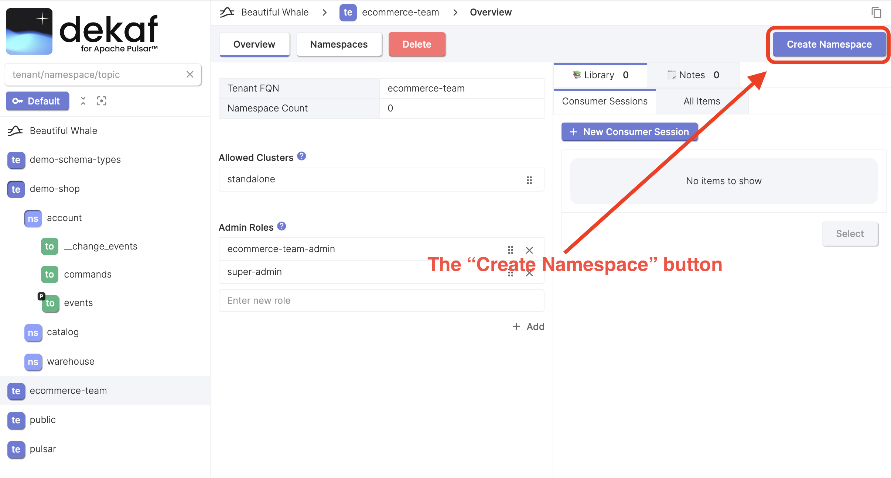
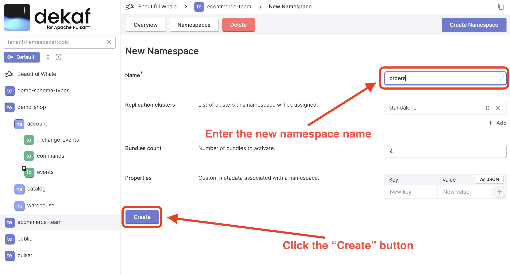
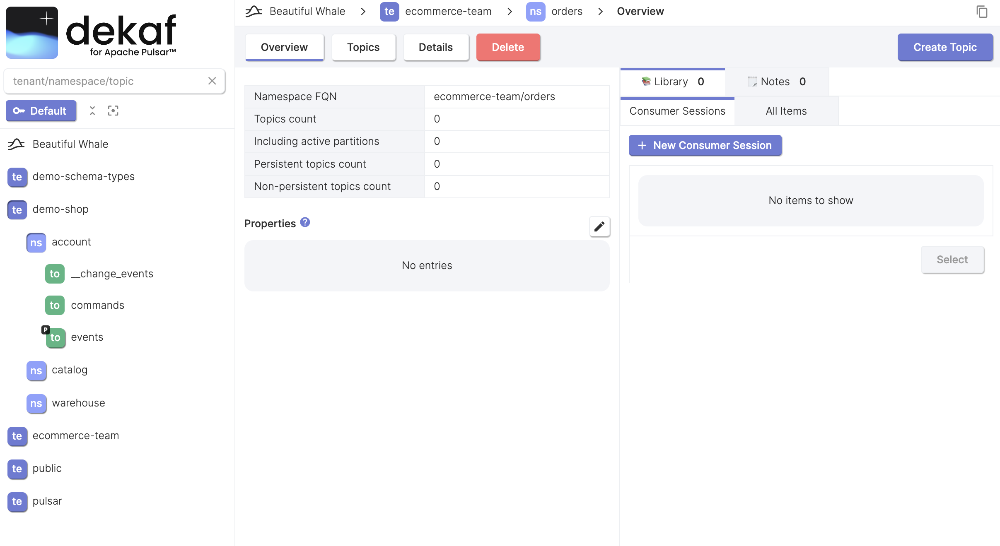

# Create Namespace

- At the [tenant page](/docs/tenants/tenant-overview) click the "Create Namespace" button.

- Enter the namespace name and fill the other field if needed.
- Click the "Create" button

- After the namespace is created, you will be taken to the namespace overview page.

