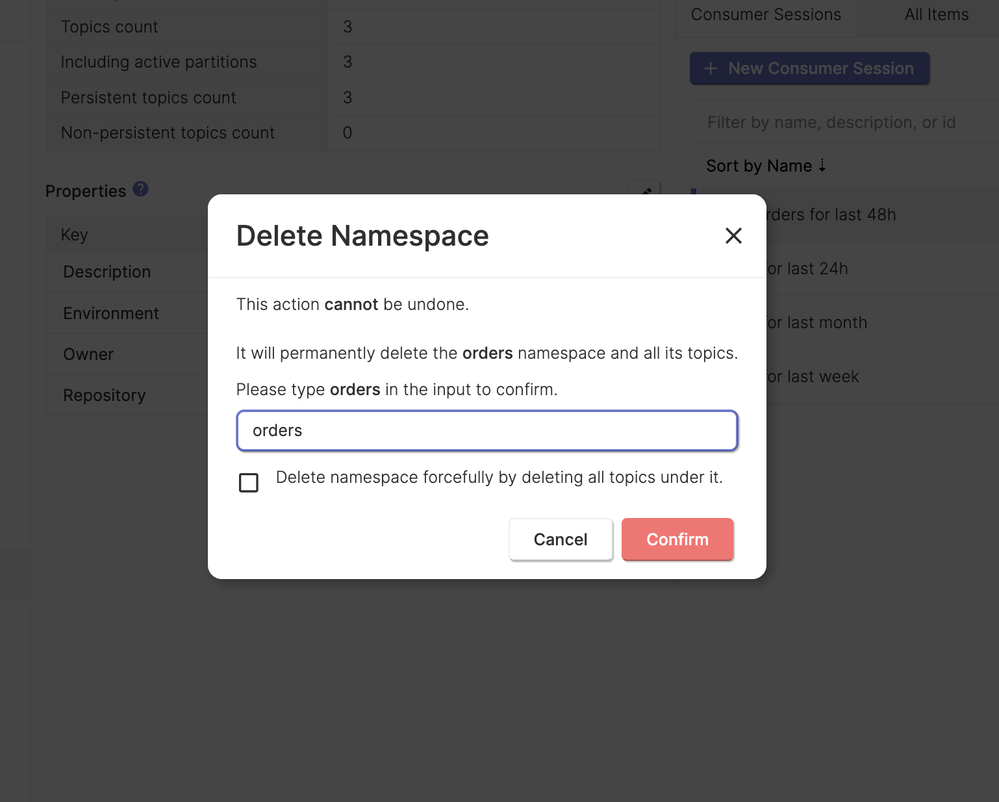
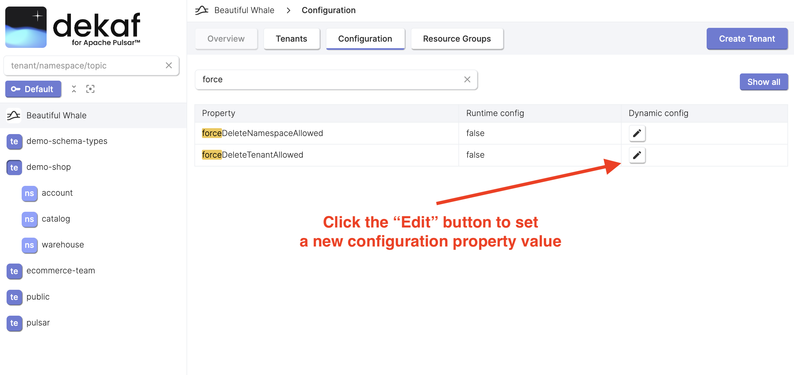

# Delete Namespace

- You can delete namespace by clicking the "Delete" button.

- You'll see the following dialog

- You can force the namespace deletion by checking the appropriate checkbox.

  :::tip

  The forceful namespace deletion feature may be disabled on the broker-level configuration.

  In order to enable it, you should set the `forceDeleteNamespaceAllowed` broker configuration property to `true`. You can do in on the instance "Configuration" page.

  

  :::
