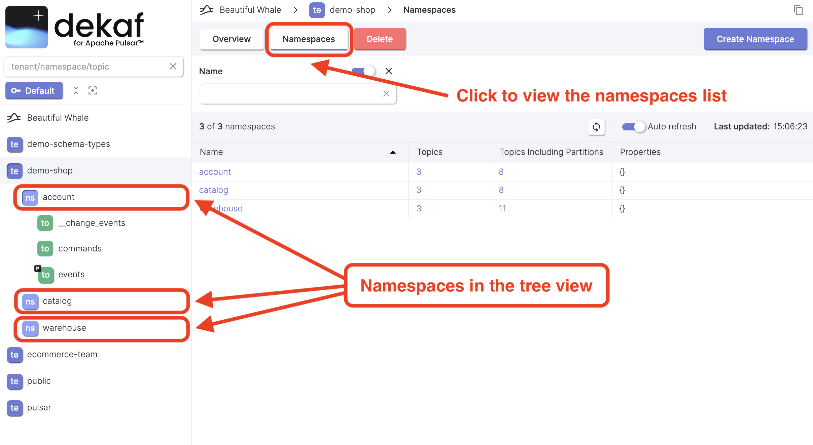

# List Namespaces

- Click the "Namespaces" button at the "Tenant" page to view the list of namespaces.
- The list of namespaces is also available in the tree view sidebar.
  Click the namespace icon or double-click the namespace name to view the list of topics withing the namespace.
- By clicking on the namespace name in the table or in the tree view, you'll be taken to the [namespace overview page](/docs/namespaces/namespace-overview).

