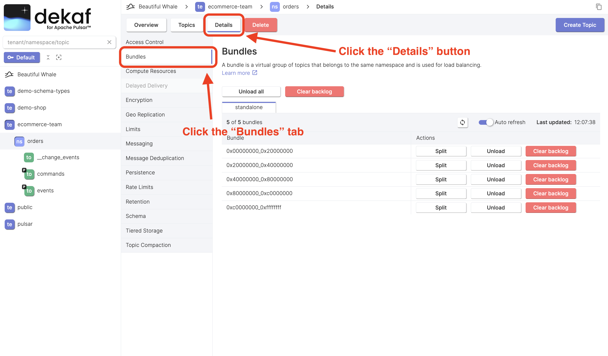

# Manage Bundles

Namespace bundle is a virtual group of namespace's topics that is assigned to specific brokers.[^1]

:::tip

If you're new to Pulsar or not going to administrate it, feel free to skip this page.

Otherwise, we recommend first reading the [Load balance across brokers](https://pulsar.apache.org/docs/next/administration-load-balance/) article on the Pulsar website.

:::

Namespace bundles allow Pulsar to distribute the workload evenly across brokers, enabling efficient resource utilization and better performance.

A namespace bundle is defined as a range between two 32-bit hashes, such as `0x00000000` and `0xffffffff`.

## Working with Namespace Bundles

- At the [namespace overview page](/docs/namespaces/namespace-overview) click the "Details" button
- Click the "Bundles" tab
- You'll see the following screen

You can perform the following actions:

- Unload all bundles
- Clear backlog for all bundles
- Split bundle
- Unload bundle
- Clear bundle backlog

[^1]: [Bundles](https://pulsar.apache.org/docs/next/concepts-broker-load-balancing-concepts/#bundles) in official Pulsar documentation
