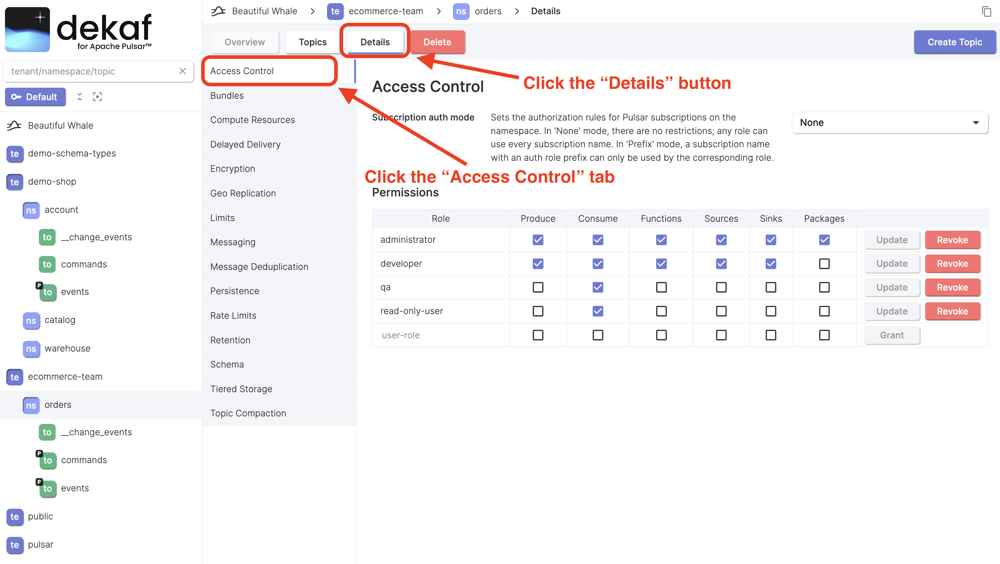
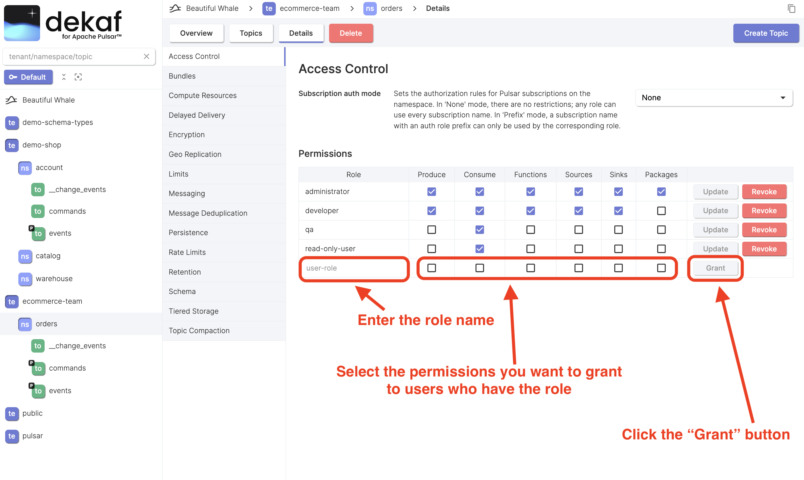
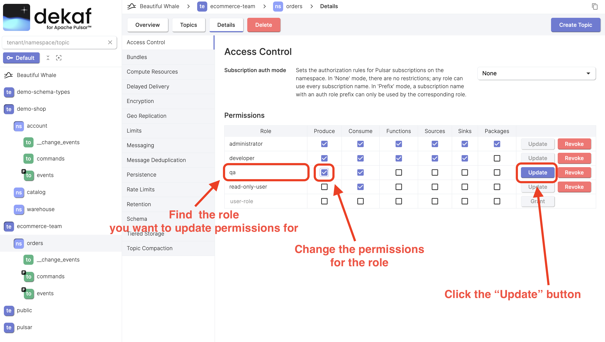
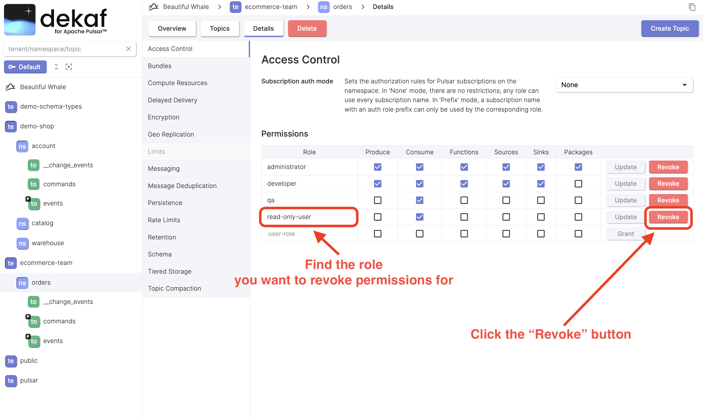
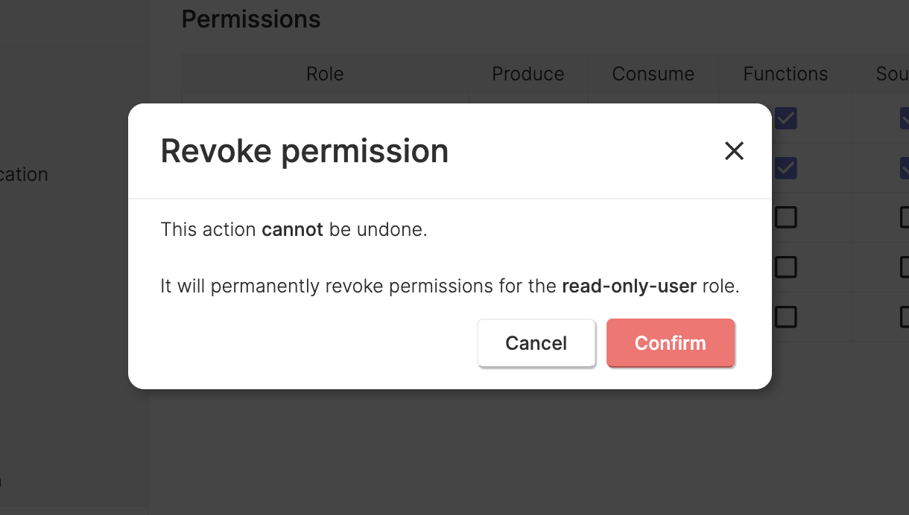

# Manage Permissions

In Pulsar, you have the option to assign permissions to users at either the namespace or topic level.[^1]

This page describes managing permissions on the namespace level.

:::tip

If you don't manage Pulsar in your organization, feel free to skip this page.

Otherwise, we recommend you to carefully read the Pulsar documentation chapters about it's security model.[^2]

:::

## View Namespace Permissions

- On the namespace overview page, click the "Details" button
- Click the "Access Control" tab
- You'll see the list of roles and their permissions

## Grant Namespace Permissions

- Enter the role name you want to grant permissions for
- Select the permissions you want to grant
- Click the "Grant" button

## Update Namespace Permissions

- Find the role you want to update permissions for
- Change the permissions for the role
- Click the "Update" button

## Revoke Namespace Permissions

- Find the role you want to revoke permissions for
- Click the "Revoke" button

- Click the "Confirm" button to confirm revoking the permissions for this role

[^1]: [Managing permissions](https://pulsar.apache.org/docs/next/admin-api-permissions/) page in Pulsar official documentation
[^2]: [Pulsar security overview](https://pulsar.apache.org/docs/next/security-overview/)
