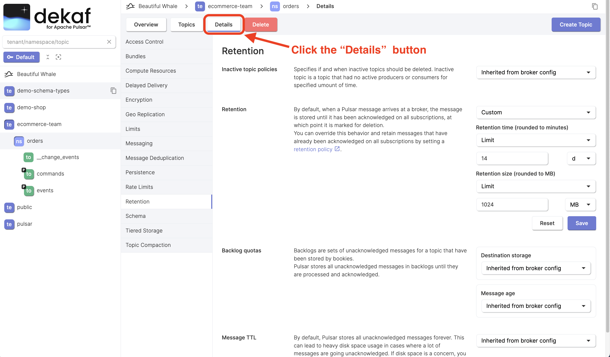

# Manage Policies

Apache Pulsar namespace policies are configurations that define rules and settings for managing resources within a namespace.

Many namespace policies inherit configuration from the broker config that is managed by Pulsar instance administrator. You can override that settings for a specific namespace.

There are also topic policies. Many of them inherit configuration from namespace policies. You can override it on the topic level.

## Update Namespace Policy

- Click the "Details" button at the [namespace overview page](/docs/namespaces/namespace-overview)
- Policies are grouped in tabs.
- Find the policy you want to change, set a new value and click the "Save" button.
