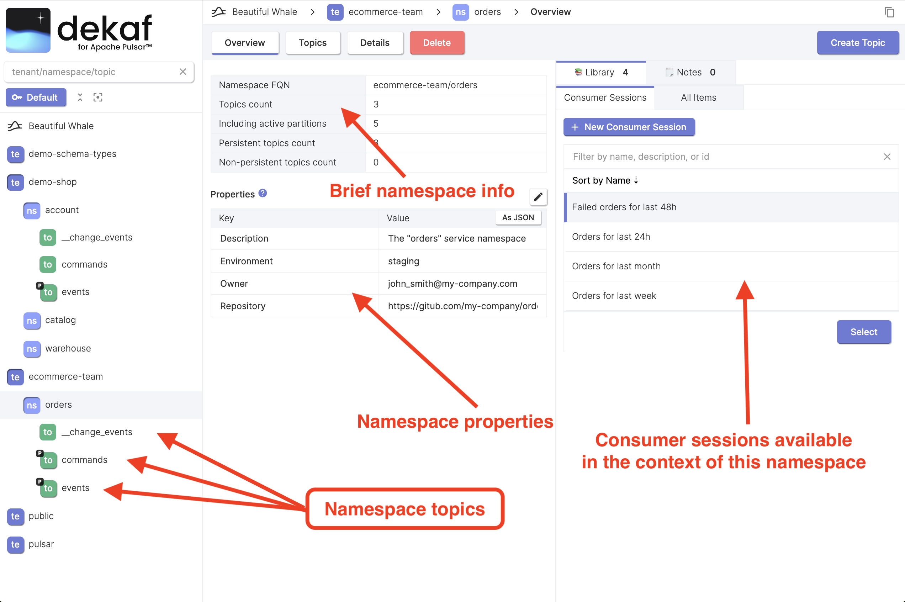

# Namespace Overview

You can find the following items on the namespace overview page:

- Fully Qualified Namespace Name (Namespace FQN)
- Topics count in this namespace
- Namespace properties

  Namespace properties is a key-value metadata that can be used for storing arbitrary information like the namespace description, ownership and contact information, tags, labels, and other.

  :::tip

  The amount of information you can store is determined by the backed metadata store: [Oxia](https://github.com/streamnative/oxia), Zookeeper, RocksDB, or other. The general recommendation is that it shouldn't be more than about a `1MB` for a single namespace.

  :::

- List of consumer sessions that are available for this namespace. See the [library documentation](/docs/library) for more info.
- Markdown notes that are attached to this namespace.  See the [notes](/docs/library/notes) documentation for more info.
- Namespace topic list in the tree view
