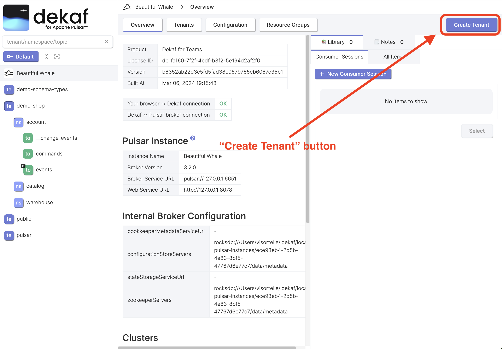

# Create Tenant

- At the Pulsar instance page click the "Create Tenant" button.

- Enter the tenant name and fill the other field if needed.
- Click the "Create" button

- After the tenant is created, you will be taken to the tenant overview page.

