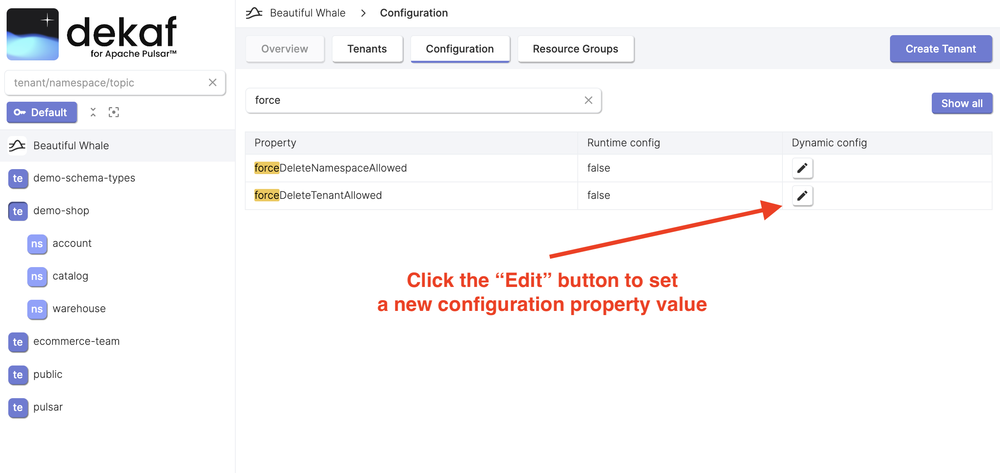

# Delete Tenant

- You can delete tenant by clicking the "Delete" button.
- You can force the tenant deletion by checking the appropriate checkbox.

  The forceful tenant deletion feature may be disabled on the broker-level configuration.

  In order to enable it, you should set the `forceDeleteTenantAllowed` and `forceDeleteNamespaceAllowed` broker configuration properties to `true`. You can do in on the instance "Configuration" page.

  
