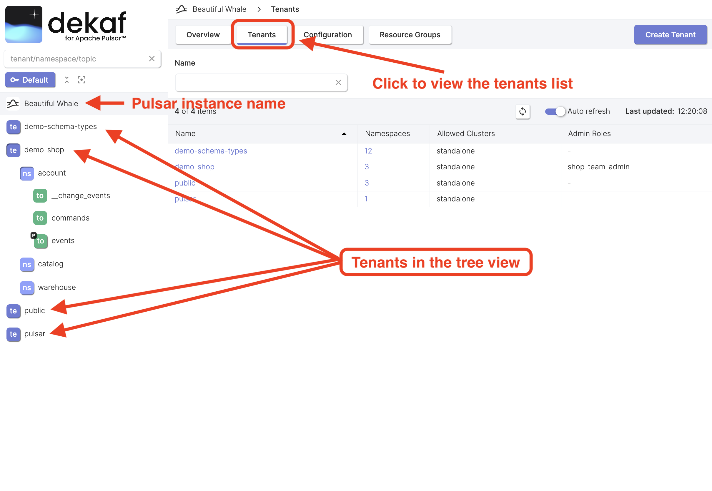

# List Tenants

- Click the "Tenants" button at the "Instance" page to view the list of tenants.
- The list of tenants is also available in the tree view sidebar.
  Click the tenant icon or double-click the tenant name to view the list of namespaces withing the tenant.
- By clicking on the tenant name in the table or in the tree view, you'll be taken to the [tenant overview page](/docs/tenants/tenant-overview).

