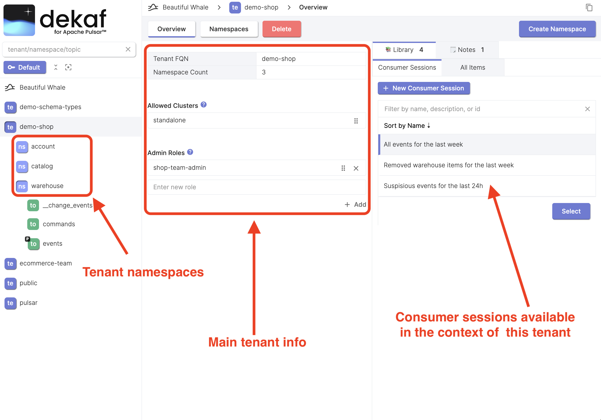

# Tenant Overview

At the tenant overview page you'll find the following items:

- Fully Qualified Tenant Name (Tenant FQN)
- Namespace count in this tenant
- Editable allowed clusters list
- Editable admin roles list
- List of consumer sessions that are available for this tenant. See the [library documentation](/docs/library) for more info.
- Markdown notes that are attached to this tenant.  See the [notes](/docs/library/notes) documentation for more info.
- Tenant namespace list in the tree view

